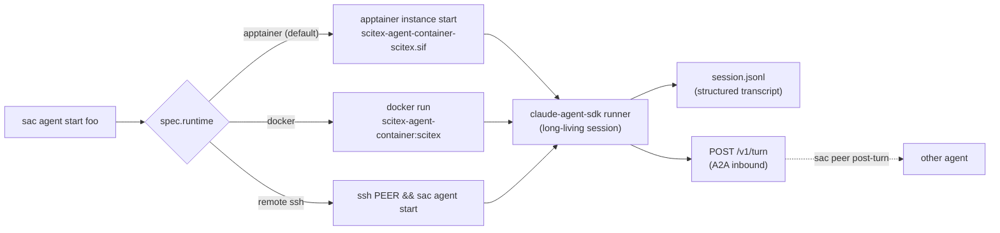

# scitex-agent-container

<p align="center">
  <a href="https://scitex.ai">
    
  </a>
</p>

<p align="center"><b>Declarative YAML-based AI agent lifecycle management — apptainer-first, layered runtime images, sandbox/freeze versioning via scitex-container.</b></p>

<p align="center">
  <a href="https://scitex-agent-container.readthedocs.io/">Full Documentation</a> · <code>uv pip install scitex-agent-container[all]</code>
</p>

<!-- scitex-badges:start -->
<p align="center">
  <a href="https://pypi.org/project/scitex-agent-container/"></a>
  <a href="https://pypi.org/project/scitex-agent-container/"></a>
  <a href="https://github.com/ywatanabe1989/scitex-agent-container/actions/workflows/test.yml"></a>
  <a href="https://codecov.io/gh/ywatanabe1989/scitex-agent-container"></a>
  <a href="https://scitex-agent-container.readthedocs.io/en/latest/"></a>
  <a href="https://www.gnu.org/licenses/agpl-3.0"></a>
</p>
<!-- scitex-badges:end -->

---

## Problem and Solution

| # | Problem | Solution |
|---|---------|----------|
| 1 | **Per-agent shell scripts don't compose** — every Claude Code agent needs its own bash glue for env vars, MCP wiring, restart policy, and inter-agent comms | **Declarative `spec.yaml` + SDK runtime** — one file fully specifies the agent (image, mounts, env, model, A2A port). `sac agent start` brings it up; the runner hosts a long-living Claude SDK session and exposes `POST /v1/turn` for agent-to-agent calls |
| 2 | **"Reproducible" containers drift** — a Dockerfile rebuilt next month installs different scitex / numpy / torch versions, even with the same base image | **Layered SIF + sandbox/freeze** — `:base` (OS+tools) and `:scitex` (scientific stack) are separate layers; `sac image sandbox` gives a writable rootfs, `sac image update` refreshes packages, `sac image freeze` bakes back to an immutable, hash-stable SIF for publication |
| 3 | **Single host doesn't scale** — running on HPC requires apptainer (no docker), but most agent toolkits are docker-only | **Apptainer-first** — apptainer is the primary runtime; layered `.def` files are canonical SSoT. Docker stays as dev-laptop convenience. `sac` delegates the build/sandbox/version lifecycle to [`scitex-container`](https://github.com/ywatanabe1989/scitex-container) |

## Solution

`scitex-agent-container` (`sac`) is a thin user-facing wrapper that ties three concerns together:

```
   spec.yaml ─┐
              ├─→ runtime image (apptainer SIF or docker)
   src_*  ────┘        │
                       ▼
              long-living Claude SDK session
                       │
                       ├─→ POST /v1/turn   (A2A inbound)
                       └─→ session.jsonl   (structured transcript)
```

The image lifecycle is delegated to `scitex-container`; the agent lifecycle stays in this package.

## Installation

Requires Python >= 3.10 and (for production runs) `apptainer` >= 1.4 on the host.

```bash
pip install scitex-agent-container
```

### Configuration

Environment variables follow the SciTeX convention: copy
[`.env.example`](.env.example) to `.env` and edit. Every sac-owned env
var has two equivalent names — a short `SAC_<X>` form and a long
`SCITEX_AGENT_CONTAINER_<X>` form (setting both with different values
raises `SacEnvConflict` at startup). The full grouped list (~40 vars)
lives in the [20_env-vars](src/scitex_agent_container/_skills/scitex-agent-container/20_env-vars.md)
skill leaf.

## Architecture

```
scitex_agent_container/
├── _runners/             ← long-living Claude SDK runner (the entry point inside the container)
├── _network/peer.py      ← A2A outbound (post_turn / resolve_peer_url)
├── _lifecycle/           ← start / stop / restart / health / handover
├── _state/               ← registry (state.db) + session.jsonl tailing
├── runtimes/             ← apptainer (primary) + docker (dev) backends
├── cli_pkg/              ← `sac` Click commands grouped by noun
└── config/               ← v3 yaml schema + validation
```

The CLI is the canonical entry point; the Python API mirrors it. Apptainer is the default runtime; docker is supported for dev laptops.

## Layered runtime images

Two `.def` recipes, layered:

| Tag | What's inside | When |
|---|---|---|
| `:base` | Ubuntu 24.04 + dev tools (git, gh, rust CLIs, mermaid, prettier, eslint, jsonlint, uv, pipx, tree, node 20) | Foundation |
| `:scitex` | `FROM :base` + ffmpeg + portaudio + `scitex[all]` + claude-agent-sdk + sac itself | **Default** when `spec.image` is unset |

```
<site-packages>/scitex_agent_container/containers/    ← recipes (ship in pip wheel)
  apptainer-{base,scitex}.def                          ← canonical SSoT
  Dockerfile.{base,scitex}                             ← docker mirrors

~/.scitex/agent-container/containers/                 ← built artifacts (user state)
  scitex-agent-container-{base,scitex}.sif
  *.sandbox/
```

Recipes ship in the pip wheel — no need to clone the repo to run `sac image build`. Built artifacts live under `~/.scitex/agent-container/containers/`, never in git.

## Quickstart

```bash
# 1. Build the layered images (one-time)
sac image build base -y     # ~15-25 min — OS + dev tools
sac image build scitex -y   # ~10-20 min with uv — FROM :base + scitex[all] (numpy / pandas /
                            #              scipy / torch / etc.). Walk away.

# 2. Define an agent
mkdir -p ~/.scitex/agent-container/agents/hello/
cat > ~/.scitex/agent-container/agents/hello/spec.yaml <<'YAML'
apiVersion: scitex-agent-container/v3
kind: Agent
spec:
  runtime: apptainer
  workdir: /tmp/hello
  model: claude-haiku-4-5
  startup_commands:
    - command: "Reply with the string 'hello-ok' and nothing else."
YAML

# 3. Run
sac agent start hello --foreground   # streams stdout, exits when done
```

## "scitex updates often, do we rebuild?"

No — sandbox once, refresh when you want, freeze when stable:

```bash
sac image build scitex --sandbox        # one-time: writable sandbox
sac image update sandbox/                # any time: pip install --upgrade scitex[all]
sac image freeze sandbox/ scitex-2.28.15.sif   # bake to immutable SIF
sac image switch 2.28.15                 # atomic flip (previous remembered)
sac image rollback                       # restore previous version
sac image snapshot -o env.json           # full reproducibility capsule
```

The build / sandbox / version / rollback verbs all delegate to [`scitex-container`](https://github.com/ywatanabe1989/scitex-container).

## 1 Interfaces

<details open>
<summary><strong>CLI ⭐⭐⭐ (primary)</strong></summary>

<br>

```bash
# Agent lifecycle
sac agent start <name> [--foreground]    # daemon by default; --foreground streams stdio
sac agent stop  <name>                    # graceful SIGTERM, escalate to SIGKILL after 5 s
sac agent restart <name>
sac agent status [<name>] [--snapshot] [--priority]
sac agent health <name>
sac agent tail   <name>                   # render session.jsonl (structured transcript)
sac agent recall <name>                   # human-readable session summary
sac agent check  <name>                   # preflight (validates yaml + probes runtime deps)
sac agent find   <capability>

# Image lifecycle (delegates to scitex-container)
sac image build [base|scitex] [--sandbox] [--runtime apptainer|docker]
sac image sandbox SOURCE                  # SIF → writable sandbox
sac image update  SANDBOX [-p PKG]        # pip install --upgrade
sac image freeze  SANDBOX OUT.sif         # sandbox → SIF
sac image list                            # installed versions
sac image switch  VERSION                 # atomic flip
sac image rollback                        # restore previous
sac image status                          # unified dashboard
sac image snapshot [-o env.json]          # reproducibility capsule

# Account / quota
sac account list / save / delete / switch / watch-quota

# Network / peers
sac host show / list / probe / exec / validate
sac peer post-turn AGENT TEXT             # A2A outbound
sac a2a serve <yamls...>                  # A2A inbound for non-SDK runtimes

# Misc
sac event ingest                          # Claude Code hook event ingestor
sac db   query / show / clean / migrate   # state.db inspection
sac registry reconcile                    # singleton placement reconcile across fleet
sac --help-recursive                      # full subcommand tree
```

</details>

## Demo



End-to-end: `sac agent start` materializes the workspace (`src_*` files + mounts + env), launches the runtime image, the SDK runner hosts a long-living session, and downstream tooling reads `session.jsonl` for state or POSTs to `/v1/turn` to drive the agent.

## YAML Spec Reference (v3)

| Section | Key Fields | Description |
|---|---|---|
| `apiVersion` | `scitex-agent-container/v3` | Config format version |
| `metadata` | `name` (auto-derived from dir), `labels` | Agent identity |
| `spec.runtime` | `apptainer` (default) / `docker` / `claude-session` (host-local) | Container backend |
| `spec.image` | path or tag | Default: `scitex-agent-container:scitex` (docker) or `~/.scitex/agent-container/containers/scitex-agent-container-scitex.sif` (apptainer) |
| `spec.workdir` | path | Workspace mounted at `/work` inside the container |
| `spec.model` | `sonnet`, `opus[1m]`, `haiku-4-5`, ... | Claude model |
| `spec.user` | `""` / `"host"` / `"<uid>:<gid>"` | Run-as user; `"host"` matches the operator |
| `spec.mounts[]` | `src`, `dst`, `mode` (ro/rw) | Bind mounts (`${VAR}` expanded at start) |
| `spec.env` | key-value pairs | Container env (`${VAR}` expanded) |
| `spec.a2a` | `port` | Bind `POST /v1/turn` on this localhost port |
| `spec.remote` | `host`, `user`, `timeout` | SSH-as-transport for cross-machine deploy |
| `spec.startup_commands[]` | `command` | One-shot turns to send to the SDK before going idle |
| `spec.health` | `enabled`, `interval`, `method: sdk-alive` | Health probe config |
| `spec.skills` | `required[]`, `available[]` | Skill auto-injection into CLAUDE.md |

`src_CLAUDE.md`, `src_state.md`, `src_mcp.json`, `src_env` siblings of `spec.yaml` are materialized into the workspace at start with `${metadata.name}` and `${ENV_VAR}` interpolation.

## Templates

`examples/agent-templates/` ships minimal pattern templates — copy and adapt:

| Template | Pattern | When to use |
|---|---|---|
| `apptainer.yaml` | claude-session inside Apptainer SIF | **Default**: HPC + reproducibility |
| `docker.yaml` | claude-session inside docker | Dev laptop where docker is already running |
| `ssh.yaml` | remote agent via SSH | Cross-machine fleet member |
| `mcp.yaml` | agent with MCP tool wiring | Specialised tool surface |

## Examples

`examples/apptainer_and_sac/` walks through the runtime in 9 lessons (build, sandbox/update/freeze, versioning, run/stop, logs/exec, mounts, env+user). Run them read-only with `bash 00_run_all.sh`, or `--apply` to execute the mutating ones.

## Part of SciTeX

`scitex-agent-container` is part of [**SciTeX**](https://scitex.ai). Install via the umbrella with `pip install scitex[agent-container]` to use as `scitex.agent_container` (Python) or `scitex agent-container ...` (CLI).

>Four Freedoms for Research
>
>0. The freedom to **run** your research anywhere — your machine, your terms.
>1. The freedom to **study** how every step works — from raw data to final manuscript.
>2. The freedom to **redistribute** your workflows, not just your papers.
>3. The freedom to **modify** any module and share improvements with the community.
>
>AGPL-3.0 — because we believe research infrastructure deserves the same freedoms as the software it runs on.

---

<p align="center">
  <a href="https://scitex.ai" target="_blank"></a>
</p>

<!-- EOF -->
