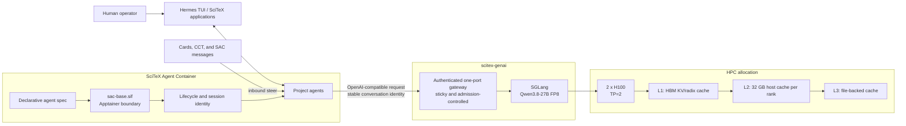

# Qwen agent fleet: observed deployment

This document records the SciTeX local-agent deployment observed on
2026-09-12. It is a measured operational snapshot, not a theoretical capacity
claim. GPU allocation, server processes, gateway configuration, and serving
logs should be checked again after every lease or deployment change.

The public infrastructure name is **HPC**. Hostnames, scheduler partitions,
and other site-specific proper names are intentionally omitted.

## Current serving profile

| Item | Observed value |
|---|---|
| Model | Qwen3.8-27B |
| Weight precision | FP8 |
| Inference engine | SGLang |
| Allocated accelerators | 2 x NVIDIA H100 |
| Server topology | one server, tensor parallelism `TP=2` |
| Maximum model context | 1,000,000 tokens |
| KV-cache precision | FP8 |
| Scheduler | longest-prefix match (`LPM`) |
| Chunked prefill | enabled; 8,192-token chunks, 32,768 batched-token maximum |
| HiCache L2 | 32 GB of host memory per TP rank |
| HiCache L3 | file-backed storage |
| Speculative decoding | EAGLE: 3 speculative steps, top-k 1, 4 draft tokens |
| Gateway active-request capacity | 2 |
| Gateway waiting queue | 8 |
| Gateway input-token budget | 1.1 million tokens |
| Cache-aware admission | observe-only |

The 1,000,000-token value is a ceiling. It does not mean every turn sends or
computes one million new tokens. Actual cost depends heavily on conversation
length and how much of its exact prefix remains reusable.

The practical admission policy for this measured topology is **two concurrent
long-running agents**. More agent sessions may exist, think, or execute tools,
but that does not establish that more than two simultaneous long model calls
are safe. The queue bounds overload instead of allowing an unbounded number of
cold prefills into the server.

## Data and control flow



The responsibilities are deliberately separated:

- `scitex-hpc` obtains accelerator allocations and launches compute inside the
  allocation.
- `scitex-genai` owns the SGLang profile, cache tiers, health checks, and the
  authenticated inference gateway.
- `scitex-agent-container` (SAC) owns agent specs, the reproducible Apptainer
  image, placement, lifecycle, and stable identities.
- Hermes owns the interactive/autonomous agent loop, persistent sessions,
  steer/queue/interrupt behavior, memory, goals, and tool execution.

This boundary lets the inference engine and agent harness evolve separately.
It also keeps the model server out of individual project environments.

## What the measurements show

### Decode rate

Observed decode throughput was **130–137 generated tokens per second**. This is
the model server's measured generation rate in the current profile, not a
per-agent service-level guarantee. Time to first token can still be dominated
by queueing, cache restoration, or cold prefill.

### Prefix reuse

A recent cumulative gateway/engine metrics window reported approximately:

- 2.63 million effective prefix tokens;
- 10.6 thousand newly computed prompt tokens;
- approximately 99.6% reuse for that window.

The percentage is `2.63M / (2.63M + 10.6k)`, rounded. It is a cumulative recent
window containing warm continuation traffic, **not** a global fleet hit rate,
not a cold-start result, and not evidence that every request gets 99.6% reuse.
The useful conclusion is narrower: warm conversations can reuse most of their
existing prefix when conversation identity and routing remain stable.

This also explains why sticky routing is required. Moving a warm conversation
to another server or restarting the engine loses its HBM-resident locality and
may require cache restoration from a slower tier or a new prefill.

### Why long agents can still feel slow

The earlier workload demonstrated head-of-line blocking: a large cold prefill
could delay a cache-hot interactive continuation. The current SGLang scheduler
uses LPM so requests with reusable prefixes are visible to scheduling. Chunked
prefill allows long prefills to be divided into bounded pieces rather than one
monolithic operation.

Those settings reduce the risk; they do not eliminate GPU contention. A cold
hundreds-of-thousands-token request still requires substantial compute, and
the two-active-request admission limit is therefore part of the serving
profile, not merely a client-side preference.

Another measured source of avoidable work was Hermes' automatic background
review. On 2026-09-12, aligned Hermes and inference-server logs showed that a
completed foreground turn immediately started a review over about 691,000
tokens on the same conversation. A gateway restart cancelled that review as
the next foreground turn began; the foreground request then had zero cached
tokens and took about 276 seconds. SAC therefore defaults
`spec.available_harnesses.hermes.background_review` to `false`. An agent may
set it to `true`, but the resulting extra full-conversation request is then an
explicit capacity decision rather than hidden traffic.

## Gateway lifecycle incident

Live testing observed stale gateway in-flight/capacity accounting after a
downstream disconnect or interrupt. Before a controlled restart, the gateway
still reported one in-flight request containing 637,325 input tokens and its
waiting queue grew from two to four. At the same time, direct SGLang metrics
reported zero running requests, zero queued requests, and zero generation
throughput; there was no gateway-to-upstream TCP connection, and the remote
Hermes socket had received zero response bytes. This is operational evidence
that a healthy, idle engine alone does not prove that gateway capacity has
been released correctly.

A controlled gateway restart cleared the stale state. The replay completed in
27.4 seconds and subsequent continuations completed in 6–50 seconds. Restart
recovery demonstrates the symptom and a temporary recovery procedure; it is
not a permanent fix.

A permanent lifecycle fix is in progress. This document does **not** claim the
incident is resolved or deployed. Until a fixed release passes disconnect,
cancellation, capacity-release, and live-restart acceptance tests, operators
must inspect both gateway admission state and engine health when diagnosing a
stall.

## Reproducible SAC artifact

The rebuilt base image observed on the infrastructure host was:

```text
sac-base-2026-0912-120102.sif
sha256 6e9082174d3c2435868a5347b5b086cb67017be30cf010bf8cef7405bf48c749
```

The digest identifies bytes, not intent. A receiving host should verify the
SHA-256 digest and the image-internal SAC, Hermes, and dependency versions
before switching its stable `sac-base.sif` symlink. An image name or successful
copy alone is insufficient provenance.

## Operational checks

After an allocation, engine, gateway, image, or agent restart, verify:

1. the allocation contains exactly the intended GPU count;
2. SGLang reports the expected model, TP, context, KV precision, scheduler,
   prefill, HiCache, and speculative-decoding settings;
3. the gateway reports the intended capacity, queue, token budget, and cache
   admission mode;
4. an authenticated model probe succeeds and an invalid credential is
   rejected;
5. the image digest and image-internal package versions match the release;
6. a resumed conversation retains its session identity and records prefix
   reuse;
7. one cold and one warm request can coexist without losing gateway capacity
   after completion or cancellation.

Use `srun --overlap` for probes performed on an allocated HPC compute node. Do
not run model-serving or benchmark workloads on an HPC login node.

## Limitations, risks, and open measurements

- Only the current two-H100, TP=2 topology is documented. TP=1 replicas and
  larger fleets have not been shown equivalent by this measurement window.
- The observed 130–137 tok/s decode range does not include a controlled 1/2/4/8
  concurrency benchmark with TTFT, TPOT, queue time, GPU utilization, and
  cache-tier traffic.
- The 99.6% figure is biased toward warm continuation requests and must not be
  generalized to newly launched agents or changed prompt prefixes.
- LPM can favor cache-hot work. Fairness and cold-request starvation need a
  longer mixed-workload measurement.
- L2/L3 cache capacity does not make restoration free. Transfer bandwidth and
  eviction behavior have not yet been characterized under sustained pressure.
- The FP8 KV quality impact has not been isolated against a higher-precision KV
  baseline for representative SciTeX agent work.
- Speculative decoding is enabled, but its isolated speedup versus the same
  profile without EAGLE has not yet been measured.
- Admission is currently observe-only with respect to cache residency. Cache
  classification is recorded but does not yet make the accept/reject decision.
- A gateway disconnect/capacity lifecycle defect remains open until its
  permanent fix is tested and deployed.
- Accelerator leases are time-limited. Engine restart or lease replacement can
  invalidate hot cache and increase first-turn latency.
- Sending repository context to a local Qwen service improves data control,
  but credentials, bind mounts, network access, and agent authority still need
  independent security review.

The next useful benchmark is a replayable mixed workload: one large cold
prefill plus one warm interactive continuation, followed by cancellation and
resume. Record prompt, newly computed, reused-prefix, queue, TTFT, TPOT, output
throughput, cache-tier utilization, and capacity-release evidence from the
same timestamped run.
